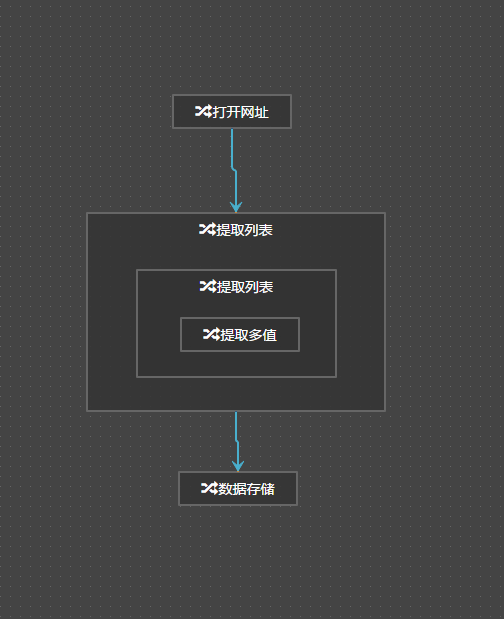

# some capture

## index page

## create task page

## config static page

## config dynamic page

## preview page

## monitor page

## monitor data page

---
---
---

# sample capture

## index page

## component page

## component detail page

## flow page

## full flow page

## preview component page

## preview result page

